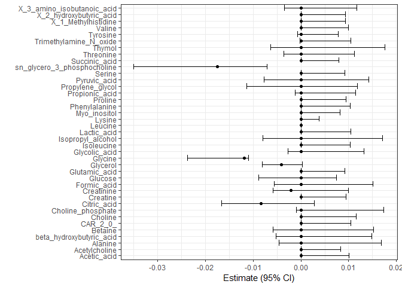
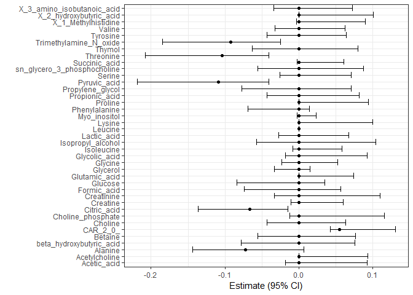

This is an R Markdown document applying Factor Analysis on preprocessed Metabolomics NMR pilot data (n=194) generated by the Christiani lab. LASSO models testing associations between factors and birthweight (n=194)/head circumference (n=193) were run on a residualized matrix where there following covariates were regressed out: maternal age, maternal bmi, gestational age (cubic splines), infant gender, parity (0 vs. not 0), maternal education (0,1,2).

Setup environment
-----------------

Load required libraries
-----------------------

``` r
library(data.table)
library(corrplot)
library(ggplot2)
library(glmnet)
library(HDCI)
library(pROC)
library("doParallel")
registerDoParallel(2)
```

Load Christiani pilot data
--------------------------

``` r
Data<-read.csv(paste0(base.dir,'\\Christiani_NMR_log_cs.csv'),header=T)
Data <- data.table(Data)
```

LASSO: Birth weight
-------------------

``` r
####################
# STAGE 1: regression
####################

XX <- apply(as.matrix(Data[,c("age","gender","educat","bmi","parity01","ga","ga.spline1","ga.spline2","ga.spline3"), with = F]),2, as.numeric)
Y <- apply(as.matrix(Data[,"birthweight", with = F]),2, as.numeric)
lm4 = lm(Y ~ XX[,"age"] + as.factor(XX[,"gender"]) + as.factor(XX[,"educat"]) + XX[,"bmi"]+ as.factor(XX[,"parity01"]) + XX[,"ga.spline1"] + XX[,"ga.spline2"] + XX[,"ga.spline3"])

####################
#STAGE 2: LASSO
####################
y <- apply(as.matrix(lm4$residuals), 2, as.numeric)
X.met <- apply(as.matrix(Data[,names(Data)[c(48:86)], with = F]),2, as.numeric)
y<- mean(Y)+y

set.seed(2009)
obj <- bootLasso(x = X.met, y = y, B = 1000, standardize = F, intercept=T, parallel.boot = FALSE, ncores.boot = 1)
B <- data.table(cbind(obj$Beta, obj$interval[1,], obj$interval[2,]))#, Estimate2 <- Coeff.lasso.2[2:dim(Coeff.lasso.2)[1]]))
setnames(B, colnames(B), c("Estimate", "LCI", "UCI"))
#write.csv(BB, file=paste0(path.to.results, "NMR.BW.LASSO",Sys.Date(), ".csv"))

#plot
B <- data.frame(B)
rownames(B) <-colnames(X.met)
p <- ggplot(B, aes(Estimate, rownames(B))) 
p + geom_point() +
  geom_errorbarh(aes(xmax = UCI, xmin = LCI))+
  xlab("Estimate (95% CI)") +
  ylab(" ") +
  theme_bw()
```



LASSO: Head circumference
-------------------------

``` r
####################
# STAGE 1: regression
####################
Data <- Data[!Data$headcircumference == ".", ]
#193

X <- apply(as.matrix(Data[,c("age","gender","educat","bmi","parity01","ga","ga.spline1","ga.spline2","ga.spline3"), with = F]),2, as.numeric)
Y <- apply(as.matrix(Data[,"headcircumference", with = F]),2, as.numeric)
lm4 = lm(Y ~ X[,"bmi"] + as.factor(X[,"educat"])+ X[,"age"]+ X[,"parity01"]+ X[,"gender"]+ X[,"ga.spline1"] + X[,"ga.spline2"] + X[,"ga.spline3"])


####################
#STAGE 2: LASSO
####################
#extract residuals
y <- apply(as.matrix(lm4$residuals), 2, as.numeric)
X.met <- apply(as.matrix(Data[,names(Data)[c(48:86)], with = F]),2, as.numeric)
y<- mean(Y)+y

set.seed(2017)
obj <- bootLasso(x = X.met, y = y, B = 1000, standardize = F, intercept=T, parallel.boot = FALSE, ncores.boot = 1)
BB<- data.table(cbind(obj$Beta,obj$interval[1,], obj$interval[2,]))
setnames(BB, colnames(BB), c("Estimate", "LCI", "UCI"))
#write.csv(BB, file=paste0(path.to.results, "NMR.HC.LASSO",Sys.Date(), ".csv"))

BB <- data.frame(BB)
rownames(BB) <-colnames(X.met)
p <- ggplot(BB, aes(Estimate, rownames(BB))) 
p + geom_point() +
  geom_errorbarh(aes(xmax = UCI, xmin = LCI))+
  xlab("Estimate (95% CI)") +
  ylab(" ") +
  theme_bw()
```


