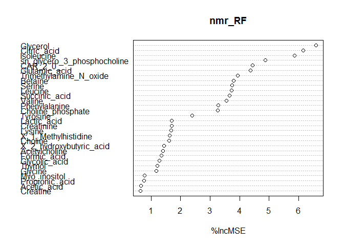
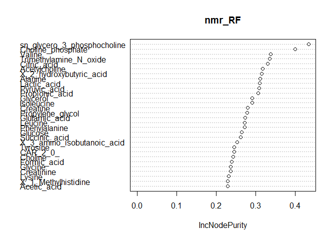
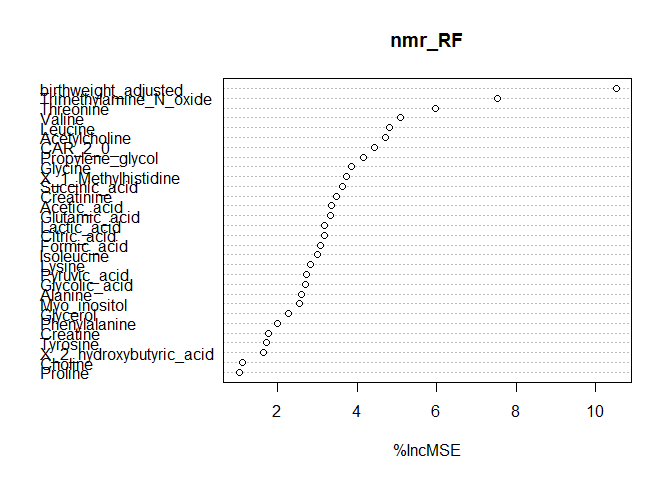
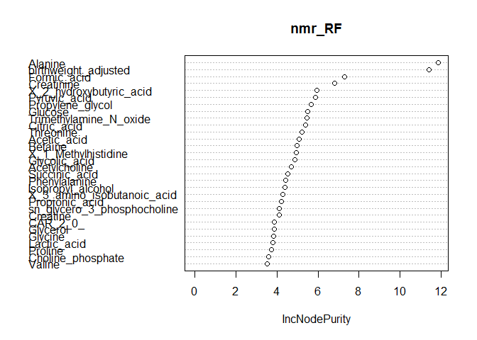

This is an R Markdown document applying Random Forest on preprocessed Metabolomics NMR pilot data (n=194) generated by the Christiani lab. Random Forest models testing associations between metabolites and birthweight (n=194)/head circumference (n=193) were run on a residualized matrix where the following covariates were regressed out: maternal age, maternal bmi, gestational age (cubic splines), infant gender, parity (0 vs. not 0), maternal education (0,1,2).

Setup environment
-----------------

Load required libraries
-----------------------

``` r
library(randomForest)
library(vita)
library(ranger)
```

Load Christiani pilot data
--------------------------

``` r
nmr<-read.csv(paste0(base.dir,'\\Christiani_NMR_log_cs.csv'),header=T)
```

Metabolite z-scores
-------------------

``` r
nmr_metab <- nmr[c(48:86)]

# z-score
nmr_metab <- as.data.frame(lapply(nmr_metab, function(i) scale(i)))
```

Residual adjustment
-------------------

``` r
##  Birthweight residual matrix
bw_model <- lm(birthweight ~ age + bmi + ga.spline1 + ga.spline2 + ga.spline3 + factor(gender) + factor(educat) + factor(parity01), data=nmr)
bw_adj <- mean(nmr$birthweight) + bw_model$residuals

nmr_metab$birthweight_adjusted <- as.vector(bw_adj)

## Head circumference residual matrix
nmr_metab_hc <- nmr_metab[-which(is.na(nmr$headcircumference)),]
nmr_hc <- nmr[-which(is.na(nmr$headcircumference)),]

hc_model <- lm(headcircumference ~ age + bmi + ga.spline1 + ga.spline2 + ga.spline3 + factor(gender) + factor(educat) + factor(parity01), data=nmr_hc)
hc_adj <- mean(nmr_hc$headcircumference) + hc_model$residuals

nmr_metab_hc$headcircumference_adjusted <- as.vector(hc_adj)
```

Birth weight tuning
-------------------

``` r
seed_RF <- 123822

#grid of random forest parameters
hyper_grid <- expand.grid(
  ntree      = 1000,
  mtry       = c(3:6),
  node_size  = seq(3, 9, by = 2),
  sampe_size = c(.55, .632, .70, .80),
  OOB_RMSE   = 0
)

#loop through RF parameters
for(i in 1:nrow(hyper_grid)) {
  
  # train model
  model <- ranger(
    formula         = birthweight_adjusted ~ ., 
    data            = nmr_metab, 
    num.trees       = 1000,
    mtry            = hyper_grid$mtry[i],
    min.node.size   = hyper_grid$node_size[i],
    sample.fraction = hyper_grid$sampe_size[i],
    seed            = seed_RF
  )
  
  # add OOB error to grid
  hyper_grid$OOB_RMSE[i] <- sqrt(model$prediction.error)
}

hyper_grid[which(hyper_grid$OOB_RMSE==min(hyper_grid$OOB_RMSE)),]
```

    ##   ntree mtry node_size sampe_size  OOB_RMSE
    ## 9  1000    3         7       0.55 0.3468171

Birth weight RF
---------------

``` r
set.seed(seed_RF)
nmr_RF <- randomForest(birthweight_adjusted ~ ., data=nmr_metab, 
                       ntree=1000, 
                       mtry=3,
                       nodesize=7, 
                       sampsize=ceiling(0.55*nrow(nmr_metab)),
                       importance=TRUE)

varImpPlot(nmr_RF,type=1)
```



``` r
varImpPlot(nmr_RF,type=2)
```



Birth weight variable selection (altman method)
-----------------------------------------------

``` r
set.seed(seed_RF)
alt_result <- PIMP(nmr_metab[-40], unlist(nmr_metab[40]), nmr_RF, S=500)

summary(alt_result)
```

    ##           Length Class  Mode     
    ## VarImp       39  -none- numeric  
    ## PerVarImp 19500  -none- numeric  
    ## type          1  -none- character
    ## call          5  -none- call

``` r
summary(PimpTest(alt_result))
```

    ## Call:
    ## PimpTest.default(Pimp = alt_result)
    ## 
    ## PIMP.default(X = nmr_metab[-40], y = unlist(nmr_metab[40]), rForest = nmr_RF, 
    ##     S = 500)
    ## type:  [1] "regression"
    ## 
    ## 
    ## 
    ##   p-values less than  0.05 :
    ##  ----------------------
    ##                             VarImp p-value  
    ## Citric_acid                 0.0022   0.044 *
    ## sn_glycero_3_phosphocholine 0.0016   0.044 *
    ## ---
    ## Signif. codes:  0 '***' 0.001 '**' 0.01 '*' 0.05 '.' 0.1 ' ' 1

Head circumference tuning
-------------------------

``` r
#grid of random forest parameters
hyper_grid <- expand.grid(
  ntree      = 1000,
  mtry       = c(3:6),
  node_size  = seq(3, 9, by = 2),
  sampe_size = c(.55, .632, .70, .80),
  OOB_RMSE   = 0
)

#loop through RF parameters
for(i in 1:nrow(hyper_grid)) {
  
  set.seed(seed_RF)
  
  # train model
  model <- ranger(
    formula         = headcircumference_adjusted ~ ., 
    data            = nmr_metab_hc, 
    num.trees       = 1000,
    mtry            = hyper_grid$mtry[i],
    min.node.size   = hyper_grid$node_size[i],
    sample.fraction = hyper_grid$sampe_size[i],
    seed            = seed_RF
  )
  
  # add OOB error to grid
  hyper_grid$OOB_RMSE[i] <- sqrt(model$prediction.error)
}

hyper_grid[which(hyper_grid$OOB_RMSE==min(hyper_grid$OOB_RMSE)),]
```

    ##   ntree mtry node_size sampe_size OOB_RMSE
    ## 3  1000    5         3       0.55 1.155867

Head circumference RF
---------------------

``` r
set.seed(seed_RF)
nmr_RF <- randomForest(headcircumference_adjusted ~ ., data=nmr_metab_hc, 
                       ntree=1000, 
                       mtry=6,
                       nodesize=7, 
                       sampsize=ceiling(0.8*nrow(nmr_metab_hc)),
                       importance=TRUE)

varImpPlot(nmr_RF,type=1)
```



``` r
varImpPlot(nmr_RF,type=2)
```



Head circumference variable selection (altman method)
-----------------------------------------------------

``` r
set.seed(seed_RF)
alt_result <- PIMP(nmr_metab_hc[-40], unlist(nmr_metab_hc[40]), nmr_RF, S=500)

summary(PimpTest(alt_result))
```

    ## Call:
    ## PimpTest.default(Pimp = alt_result)
    ## 
    ## PIMP.default(X = nmr_metab_hc[-40], y = unlist(nmr_metab_hc[40]), 
    ##     rForest = nmr_RF, S = 500)
    ## type:  [1] "regression"
    ## 
    ## 
    ## 
    ##   p-values less than  0.05 :
    ##  ----------------------
    ##                         VarImp p-value    
    ## Alanine                 0.0119  <2e-16 ***
    ## Citric_acid             0.0122  <2e-16 ***
    ## Creatinine              0.0190  <2e-16 ***
    ## Glutamic_acid           0.0139  <2e-16 ***
    ## Glycine                 0.0135  <2e-16 ***
    ## Isoleucine              0.0141  <2e-16 ***
    ## Leucine                 0.0223  <2e-16 ***
    ## Lysine                  0.0115  <2e-16 ***
    ## Phenylalanine           0.0075   0.004 ** 
    ## Proline                 0.0033   0.036 *  
    ## Threonine               0.0358  <2e-16 ***
    ## Tyrosine                0.0050   0.010 *  
    ## Valine                  0.0205  <2e-16 ***
    ## CAR_2_0_                0.0201  <2e-16 ***
    ## X_2_hydroxybutyric_acid 0.0070  <2e-16 ***
    ## Acetic_acid             0.0125  <2e-16 ***
    ## Choline                 0.0037   0.028 *  
    ## Creatine                0.0072   0.004 ** 
    ## Formic_acid             0.0109  <2e-16 ***
    ## Glycerol                0.0101  <2e-16 ***
    ## Glycolic_acid           0.0107  <2e-16 ***
    ## Lactic_acid             0.0115  <2e-16 ***
    ## Acetylcholine           0.0284  <2e-16 ***
    ## Propionic_acid          0.0040   0.018 *  
    ## Propylene_glycol        0.0163  <2e-16 ***
    ## Pyruvic_acid            0.0154  <2e-16 ***
    ## Succinic_acid           0.0142  <2e-16 ***
    ## Trimethylamine_N_oxide  0.0433  <2e-16 ***
    ## Myo_inositol            0.0091  <2e-16 ***
    ## X_1_Methylhistidine     0.0145  <2e-16 ***
    ## birthweight_adjusted    0.0620  <2e-16 ***
    ## ---
    ## Signif. codes:  0 '***' 0.001 '**' 0.01 '*' 0.05 '.' 0.1 ' ' 1
