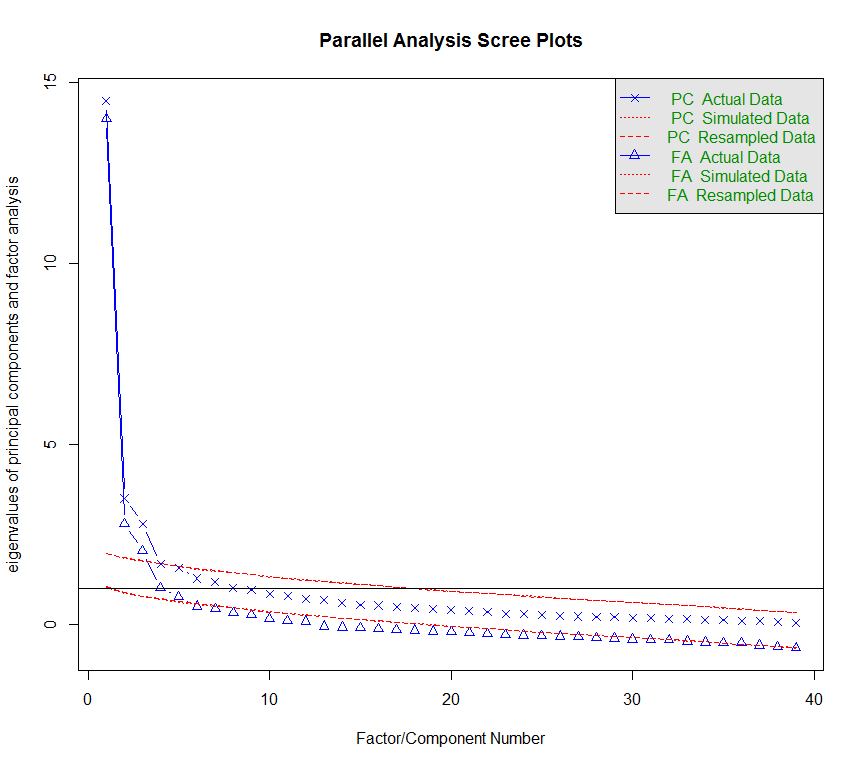
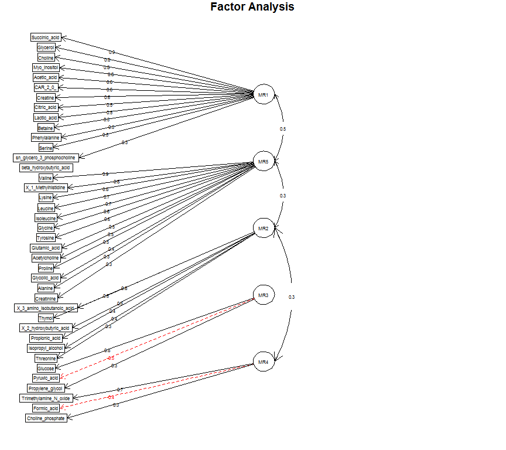
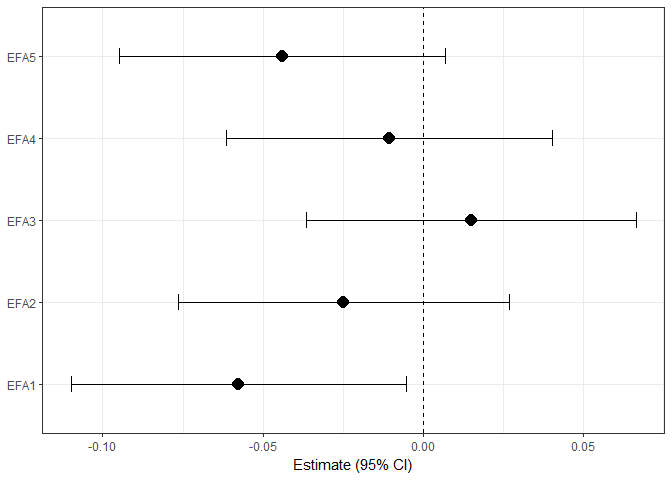
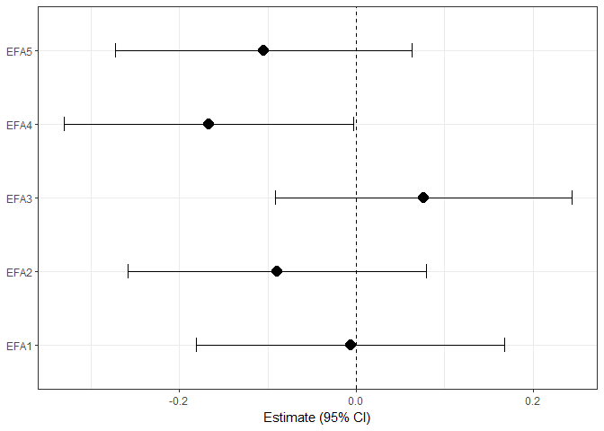

This is an R Markdown document applying Factor Analysis on preprocessed Metabolomics NMR pilot data (n=193) generated by the Christiani lab.

Setup environment
-----------------

Load required libraries
-----------------------

``` r
library(psych)
library(nFactors)
library(GPArotation)
library(ggplot2)
library(tidyr)
library(dplyr)
library(broom)
```

Load Christiani pilot data
--------------------------

``` r
NMR_log_cs<-read.csv(paste0(base.dir,'\\Christiani_NMR_log_cs.csv'),header=T)
#load(url('https://github.com/CHEAR-Metabolomics/Data/blob/master/Christiani_NMR.RData'))
```

Subset data to metabolites
--------------------------

``` r
names(NMR_log_cs)
NMR_sub<-NMR_log_cs[complete.cases(NMR_log_cs$ID),c(2,48:86)]
row.names(NMR_sub)<-NMR_sub$ID;NMR_sub<-NMR_sub[,-1]
dim(NMR_sub)
```

Determine factors underlying NMR log2/center/scaled dataset
-----------------------------------------------------------

``` r
ev <- eigen(cor(NMR_sub)) # get eigenvalues
ap <- fa.parallel(NMR_sub) # Consensus is 5 factors
```



    ## Parallel analysis suggests that the number of factors =  5  and the number of components =  3

``` r
#nS <- scree(NMR_sub)
#VSS.scree(NMR_sub) 
#vss <- vss(NMR_sub,title="Very Simple Structure")


fa <- fa(NMR_sub,5,n.obs = 194,fm="minres", scores="tenBerge", warnings=TRUE)
#print(fa,cut=0.3,digits=3, sort=T)
fa.diagram(fa,rsize=0.15)
```



``` r
fa_loadings<-unclass(fa$loadings)
fa_loadings<-as.data.frame(fa_loadings)

write.csv(fa_loadings, paste0(base.dir,"\\FactorAnalysis\\NMR_EFA_full_loadings.csv"), row.names = T)

cut<-function(x) {ifelse(abs(x)<0.3,0,x)}
fa_loadings<-as.data.frame(t(apply(fa_loadings,1,cut)))
max_abs<-function (x) {max(abs(x))}
fa_loadings$max_abs<-apply(fa_loadings[,1:5],1,max_abs)
max_factor<-function (x) {which.max(abs(x))}
fa_loadings$max_factor<-colnames(fa_loadings)[apply(fa_loadings[,1:5],1,max_factor)] 
fa_loadings$max_factor<-ifelse(fa_loadings$max_abs==0,"None",fa_loadings$max_factor)
fa_loadings<-fa_loadings[order(fa_loadings$max_factor,-fa_loadings$max_abs),]

write.csv(fa_loadings, paste0(base.dir,"\\FactorAnalysis\\NMR_EFA_loadings.csv"), row.names = T)

Alldata_scores<-fa$scores
write.csv(Alldata_scores, paste0(base.dir,"\\FactorAnalysis\\NMR_EFA_scores.csv"), row.names = T)
```

Linear regression models of metabolite factors against birth weight z-scores (log2 transformed/centered/scaled)
---------------------------------------------------------------------------------------------------------------

``` r
NMR_EFA<-read.csv(paste0(base.dir,'\\FactorAnalysis\\NMR_EFA_scores.csv'),row.names=1)
NMR_EFA$ID<-row.names(NMR_EFA)
Data<-merge(NMR_log_cs,NMR_EFA,by='ID')

Data$parity01<-as.factor(ifelse(Data$parity==0,0,1))
Data$gender<-as.factor(Data$gender)
Data$educat<-as.factor(Data$educat)

Data.set<-Data%>%
  select(ID,parity01,gender,educat,ga.spline1,ga.spline2,ga.spline3,bmi,birthweight,headcircumference,MR1,MR2,MR3,MR4,MR5)%>%
  rename(EF1=MR1,EF2=MR2,EF3=MR3,EF4=MR4,EF5=MR5)%>%
  gather(Factor,Score,-c(ID,parity01,gender,educat,ga.spline1,ga.spline2,ga.spline3,bmi,birthweight,headcircumference))

#crude models
BW.fit_crude = Data.set %>% 
  group_by(Factor) %>%
  do(tidy(glm(birthweight ~ Score, data = .),conf.int=T))%>%
  filter(term=='Score')

#adjusted models
BW.fit_adj = Data.set %>% 
  group_by(Factor) %>%
  do(tidy(glm(birthweight ~ Score + bmi+ga.spline1+ga.spline2+ga.spline3+parity01+gender+educat, data = .),conf.int=T))%>%
  filter(term=='Score')

#save BW table
write.csv(BW.fit_adj, paste0(base.dir,"\\FactorAnalysis\\NMR_EFA_BW_Table1.csv"), row.names = T)
```

NMR/BW EFA Figure
=================

``` r
BW.fit_adj%>%
  dplyr::rename(LCL=conf.low,UCL=conf.high)%>%
  ggplot(data=.,aes(x=estimate,y=Factor))+
  geom_point(size=4,shape=16)+
  geom_errorbarh(aes(xmin=LCL,xmax=UCL),height=0.2)+
  geom_vline(xintercept=0,linetype="dashed")+
  labs(x='Estimate (95% CI)')+
  theme_bw()+
  theme(axis.title.y=element_blank())
```



Linear regression models of metabolite factors against hc (log2 transformed/centered/scaled)
--------------------------------------------------------------------------------------------

``` r
NMR_EFA<-read.csv(paste0(base.dir,'\\FactorAnalysis\\NMR_EFA_scores.csv'),row.names=1)
NMR_EFA$ID<-row.names(NMR_EFA)
Data<-merge(NMR_log_cs,NMR_EFA,by='ID')

Data$parity01<-as.factor(ifelse(Data$parity==0,0,1))
Data$gender<-as.factor(Data$gender)
Data$educat<-as.factor(Data$educat)

Data.set<-Data%>%
  select(ID,parity01,gender,educat,ga.spline1,ga.spline2,ga.spline3,bmi,birthweight,headcircumference,MR1,MR2,MR3,MR4,MR5)%>%
  rename(EF1=MR1,EF2=MR2,EF3=MR3,EF4=MR4,EF5=MR5)%>%
  gather(Factor,Score,-c(ID,parity01,gender,educat,ga.spline1,ga.spline2,ga.spline3,bmi,birthweight,headcircumference))

#crude models
HC.fit_crude = Data.set %>% 
  group_by(Factor) %>%
  do(tidy(glm(headcircumference ~ Score, data = .),conf.int=T))%>%
  filter(term=='Score')

#adjusted models
HC.fit_adj = Data.set %>% 
  group_by(Factor) %>%
  do(tidy(glm(headcircumference ~ Score + bmi+ga.spline1+ga.spline2+ga.spline3+parity01+gender+educat, data = .),conf.int=T))%>%
  filter(term=='Score')

write.csv(HC.fit_adj, paste0(base.dir,"\\FactorAnalysis\\NMR_EFA_HC_Table1.csv"), row.names = T)
```

NMR/HC EFA Figure
=================

``` r
HC.fit_adj%>%
  dplyr::rename(LCL=conf.low,UCL=conf.high)%>%
  ggplot(data=.,aes(x=estimate,y=Factor))+
  geom_point(size=4,shape=16)+
  geom_errorbarh(aes(xmin=LCL,xmax=UCL),height=0.2)+
  geom_vline(xintercept=0,linetype="dashed")+
  labs(x='Estimate (95% CI)')+
  theme_bw()+
  theme(axis.title.y=element_blank())
```


